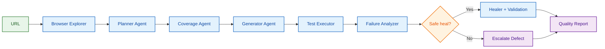

# AIVAR — Autonomous Test Orchestration Agent

AIVAR is an autonomous QA orchestration system for web applications. It accepts a target URL, explores the live UI, plans meaningful test scenarios, checks coverage gaps, generates Playwright tests, executes them, and classifies failures as either recoverable UI drift or genuine application defects.

The project was designed to demonstrate a closed-loop testing workflow in which AI reasoning is grounded in live browser observations and then constrained by deterministic validation before a locator or test step is accepted.

## Why this project exists

Modern web applications change quickly. Labels, selectors, and page layouts often change without changing business intent, and that causes brittle automated tests. In many teams, regressions are detected late and the cost of fixing flaky tests is high.

AIVAR addresses this by combining:

- Live browser exploration from real pages
- LLM-assisted planning grounded in observed app state
- Coverage analysis to detect missing scenarios
- Automatic Playwright test generation
- Execution and evidence capture
- Failure diagnosis and safe healing
- Reporting for developers and project stakeholders

## High-level pipeline



The system is intentionally closed-loop. Coverage gaps can trigger replanning, and a potential selector fix is only accepted if it is supported by the live DOM and passes deterministic validation.

## Architecture overview


### 1. Browser exploration layer

The exploration layer inspects the live UI using Playwright. It collects:

- Page title and URL
- Form fields and input labels
- Buttons and links
- Observed text and role metadata
- Navigation opportunities
- Potential authentication or checkout flows

This observation is the grounding source for all downstream planning and generation.

### 2. Planning layer

The planner agent converts the observed app state into a structured test plan. It creates a set of scenarios such as:

- Happy path flows
- Negative validation cases
- Edge conditions
- Error-state scenarios

It can also consider developer intent or a supplied PRD excerpt, but it must remain grounded in what the observed site actually supports.

### 3. Coverage analysis layer

The coverage agent evaluates whether the current scenario set is sufficiently broad. It checks whether the plan includes coverage across the key categories:

- Happy paths
- Negative paths
- Edge cases
- Error states

If coverage is below a configured threshold, the orchestrator can trigger a replan loop.

### 4. Test generation layer

The generator creates executable Playwright tests from the test plan. It adds prerequisite steps such as:

- Login steps when credentials are available
- Navigation or flow setup
- Cart or checkout prerequisites where needed
- Form input setup for realistic test journeys

Generated tests also include business assertions and state checks tied to the expected user outcomes.

### 5. Execution layer

The executor runs the generated tests against the target application. It captures:

- Execution status
- Assertions and failures
- Screenshots for evidence
- Runtime artifacts per test
- Pass, fail, healed, escalated, and blocked outcomes

### 6. Failure analysis and healing layer

When a test fails, AIVAR classifies the issue before repair. Two important cases are handled:

- A locator mismatch or UI text drift that can be safely repaired
- A real application defect that should be escalated instead of auto-healed

The healing path uses deterministic validation to check if a candidate replacement is unique, visible, enabled, and consistent with the live DOM. If the evidence is weak or ambiguous, the system does not force a repair.

### 7. Reporting layer

The result is compressed into a structured quality report that stores:

- Test counts
- Pass/fail/heal/escalation totals
- Coverage score and gaps
- Healer actions
- Risk classification
- Persisted execution artifacts

The system can export JSON and PDF reports for demo and stakeholder review.

## Agent pipeline design

The orchestration flow is implemented in the AIVAR orchestrator and follows a staged agent pipeline.

### PlannerAgent

File: `app/agents/planner.py`

Responsible for:

- Observing the application state
- Turning that observation into a grounded test plan
- Producing scenario IDs, flows, categories, priorities, and expected outcomes
- Respecting developer intent and PRD context when available

### CoverageAgent

File: `app/agents/coverage.py`

Responsible for:

- Evaluating whether the planned scenarios cover key behavior categories
- Scoring the plan using a coverage threshold
- Identifying missing or weak areas
- Triggering replanning when coverage is insufficient

### GeneratorAgent

File: `app/agents/generator.py`

Responsible for:

- Converting plan scenarios into executable Playwright actions
- Normalizing selected targets
- Adding login or cart prerequisites
- Filtering out ungrounded navigations
- Repairing mismatched assertions to avoid false failures

### BrowserExplorer

File: `app/browser/explorer.py`

Responsible for:

- Walking the live app
- Detecting interactive controls
- Collecting links, forms, observable text, and page structure
- Providing the model context for the full pipeline

### TestExecutor

File: `app/browser/executor.py`

Responsible for:

- Running each generated test
- Capturing evidence and screenshots
- Handling retries with approved healed locators
- Reporting status per test case

### FailureAnalyzer and Healer

Files:

- `app/agents/failure_analyzer.py`
- `app/healing/healer.py`
- `app/healing/validator.py`

Responsible for:

- Classifying failure type
- Proposing valid locator replacements
- Verifying candidate selectors against the live DOM
- Rejecting unsafe changes
- Escalating genuine defects

## Data and execution flow

AIVAR uses a structured model-driven workflow with Pydantic schemas for the core entities:

- Observations
- Test plans
- Generated tests
- Execution results
- Coverage analysis
- Healing proposals
- Quality reports

This makes the pipeline easier to reason about, validate, and report across different stages.

## Project structure

```text
app/
  agents/
    planner.py
    coverage.py
    generator.py
    failure_analyzer.py
    prd_gap.py
  browser/
    explorer.py
    executor.py
  healing/
    healer.py
    validator.py
  llm/
    client.py
  models/
    schemas.py
  orchestration/
    orchestrator.py
  reporting/
    pdf.py
    store.py
  config.py
  main.py

static/
  index.html
  app.js
  report.html
  styles.css

demo_web/
  index.html
  error/
    index.html

scripts/
  run_demo.py
  serve_demo.py
  serve_retail_demo.py
  test_sarvam.py

tests/
  test_models.py
  test_llm_client.py
  test_execution_diagnostics.py
  test_credentials.py
```

## Environment configuration

Create a local `.env` file from `.env.example` and configure your provider settings.

Supported providers:

- `mock`
- `sarvam`
- `gemini`

Example variables:

```bash
LLM_PROVIDER=mock
GEMINI_API_KEY=your_key_here
GEMINI_MODEL=gemini-3.6-flash
SARVAM_API_KEY=your_key_here
SARVAM_MODEL=sarvam-105b
SARVAM_MAX_TOKENS=4096
SARVAM_REASONING_EFFORT=none
AIVAR_HEADLESS=false
COVERAGE_THRESHOLD=0.75
MAX_REPLAN_ATTEMPTS=2
MAX_HEAL_ATTEMPTS=1
```

Important security note:

- Do not commit real API keys or credentials.
- Credentials are intentionally kept out of LLM prompts.
- Authenticated scenarios are marked BLOCKED if credentials are missing.

## How to run locally

### 1. Create a virtual environment

```bash
python -m venv .venv
```

On macOS/Linux:

```bash
source .venv/bin/activate
```

On Windows PowerShell:

```powershell
.\.venv\Scripts\Activate.ps1
```

If PowerShell blocks the activation script because of execution policy restrictions, run:

```powershell
Set-ExecutionPolicy -Scope Process -ExecutionPolicy Bypass
.\.venv\Scripts\Activate.ps1
```

> Warning: this only affects the current PowerShell session and does not permanently change your system policy. It is a safe workaround for local development and demo runs.

### 2. Install dependencies

```bash
pip install -r requirements.txt
```

### 3. Install Playwright browser engine

```bash
playwright install chromium
```

### 4. Start the FastAPI app

```bash
uvicorn app.main:app --reload --port 8000
```

Open the UI at:

```text
http://127.0.0.1:8000
```

### 5. Run a demo target

You can start the built-in demo app with:

```bash
python scripts/serve_demo.py
```

Then enter the local demo target URL into the web UI or use the API directly.

## Running through the API

The backend exposes a run endpoint at:

```text
POST /run
```

Example request:

```bash
curl -X POST "http://127.0.0.1:8000/run" \
  -F "url=http://127.0.0.1:9100" \
  -F "username=test-user" \
  -F "password=test-pass" \
  -F "description=Validate login and logout flow"
```

The response includes a structured `QualityReport` object with execution results and outcome summaries.

## Demo scenarios

The project includes demo flows to validate the core logic:

1. Normal execution
   - Explore the app
   - Generate tests
   - Execute them
   - Publish a quality report

2. Safe locator healing
   - Change a UI label such as “Login” to “Sign In”
   - Show that the system identifies a failing locator candidate
   - Validate and accept a safe replacement
   - Re-run the test

3. Genuine defect escalation
   - Trigger a page error or HTTP 500
   - Classify it as a real application defect
   - Escalate instead of auto-healing

## Quality report output

AIVAR produces rich reports showing:

- Test coverage score
- Scenario totals
- Passed/healed/failed/escalated/blocked counts
- Healer actions and remediation choices
- Risk assessment
- Stored execution artifacts and screenshots

Reports can be downloaded in PDF or inspected in the UI.

## Key engineering principles

- Grounding over guessing: AI decisions must be based on live app observations.
- Safe healing: never change a locator unless validation confirms it is valid.
- Closed-loop execution: coverage gaps can trigger re-planning.
- Evidence-first reporting: every outcome should be explainable.
- No silent credential guessing: blocks are reported when authentication is incomplete.

## Limitations and future work

This is a strong prototype and hackathon-ready implementation, but there are opportunities for expansion:

- Additional browser support beyond Chromium
- More enterprise workflows and multi-page app scenarios
- Improved reporting analytics
- Better handling of flaky or dynamic UI states
- Expanded model provider integration

## Summary

AIVAR demonstrates how autonomous QA can move beyond static script generation into a more adaptive system that:

- explores real product behavior,
- plans realistic tests,
- checks coverage,
- executes browser tests,
- heals safe UI drift,
- and escalates true defects responsibly.

This makes it a practical blueprint for AI-assisted test orchestration in real software delivery environments.
